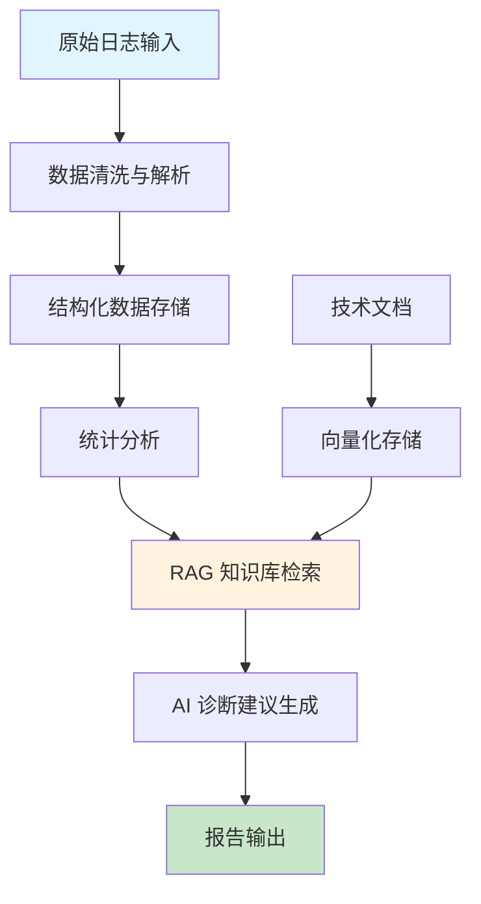

# 工业日志智能分析仪系统架构报告

>


## 1. 系统概述

工业日志智能分析仪是一个基于 AI 的工业设备故障处理 RAG（检索增强生成）系统，专门用于分析和查询工业设备故障处理技术文档。系统采用双入口设计，包含 Web 界面和命令行界面，两者共享核心分析逻辑，为工业设备运维提供智能化的故障诊断和处理建议。

### 1.1 核心定位

- **目标用户**: 工业设备运维工程师、自动化系统管理员
- **核心价值**: 将原始工业日志转化为可操作的中文诊断建议，提升故障处理效率
- **技术特色**: RAG 技术增强的 AI 诊断，支持多格式日志解析和工业级错误代码匹配

### 1.2 系统特点

- **多格式兼容**: 支持标准日志、syslog、JSON 行日志等多种格式
- **智能去重**: 自动识别重复告警，避免信息冗余
- **知识增强**: RAG 技术结合设备手册，提供精准诊断
- **双模式运行**: Web 界面适合交互式分析，命令行适合批处理和自动化
- **故障自检**: 集成 `health_check` 机制，启动时自动检测向量库状态及嵌入模型完整性，确保工业级稳健性。

## 2. 技术栈

* **前端框架**: Streamlit (Web) / Python Fire or Argparse (CLI)

* **大语言模型**: DeepSeek-V3 (via OpenAI SDK)

* **向量数据库**: ChromaDB (用于本地持久化存储向量数据)

* **嵌入模型**: `paraphrase-multilingual-MiniLM-L12-v2`(支持中英多语言工业手册)

* **扩展协议**: MCP (Model Context Protocol) -- 用于集成 Google Search 实时检索

  

### 2.1 核心技术

| 技术类别 | 技术栈 | 版本要求 | 用途 |
|---------|--------|----------|------|
| **AI 服务** | DeepSeek Chat API | - | 中文诊断建议生成 |
| **Web 框架** | Streamlit | >=1.32.0 | 交互式 Web 界面 |
| **RAG 引擎** | ChromaDB | >=0.5.0 | 向量数据库 |
| **嵌入模型** | Sentence Transformers | >=2.6.0 | 文本向量化 |
| **日志解析** | Python 正则表达式 | - | 多格式日志解析 |
| **文档处理** | pdfplumber, python-docx | >=0.10.0, >=1.1.0 | PDF/DOCX 解析 |

### 2.2 依赖管理

```bash
# 核心依赖
openai>=1.0.0              # DeepSeek API 客户端
python-dotenv==1.2.2       # 环境变量管理
streamlit>=1.32.0          # Web 界面框架
chromadb>=0.5.0            # 向量数据库
sentence-transformers>=2.6.0 # 嵌入模型
pdfplumber>=0.10.0         # PDF 解析
python-docx>=1.1.0         # DOCX 解析
```

### 2.3 环境配置

```bash
# 必需配置
OPENAI_API_KEY=your_deepseek_api_key
LOG_DIR=./logs                    # 日志文件目录
OUTPUT_DIR=./output               # 报告输出目录
LOG_LEVEL=INFO                    # 日志级别

# 可选配置
CHROMA_DB_PATH=./chroma_db        # 向量数据库路径
```

## 3. 数据流图逻辑

### 3.1 整体数据流



### 3.2 详细数据处理流程

#### 3.2.1 日志输入阶段

1. **文件上传**: 支持 .log, .txt 文件批量上传
2. **文本粘贴**: 支持直接粘贴日志内容
3. **格式检测**: 自动识别日志格式类型

#### 3.2.2 数据清洗与解析

```python
# 多格式日志正则匹配
LOG_PATTERNS = [
    # 标准格式：2024-01-15 08:32:11 [ERROR] PLC-01 message
    re.compile(r"(?P<timestamp>\d{4}-\d{2}-\d{2} \d{2}:\d{2}:\d{2})\s+\[(?P<level>\w+)\]\s+(?P<device>\S+)\s+(?P<message>.+)"),
    # JSON 格式：{"timestamp":"...","level":"ERROR","device":"PLC-01","message":"..."}
    # syslog 格式：Jan 15 08:32:11 PLC-01 ERROR: message
    # ISO 8601 格式：2024-01-15T08:32:11 [ERROR] PLC-01 message
]
```

**解析步骤**:
1. 时间戳标准化（支持多种格式）
2. 级别统一（WARN→WARNING, FATAL→CRITICAL）
3. 设备名提取
4. 消息内容标准化

#### 3.2.3 向量化存储

```python
# 文档分块策略
def _chunk(text: str) -> list[str]:
    chunks, start = [], 0
    while start < len(text):
        chunks.append(text[start : start + CHUNK_SIZE])  # 400字符窗口
        start += CHUNK_SIZE - CHUNK_OVERLAP              # 60字符重叠
    return [c.strip() for c in chunks if c.strip()]
```

**向量化流程**:
1. 文档分块（400字符窗口，60字符重叠）
2. 使用 paraphrase-multilingual-MiniLM-L12-v2 模型生成向量
3. 存储到 ChromaDB，包含元数据（来源、索引）

#### 3.2.4 AI 诊断建议生成

```python
# RAG 增强的提示词构造
user_msg = (
    f"工业设备告警：\n"
    f"  设备：{entry['device']}\n"
    f"  时间：{entry['timestamp']}\n"
    f"  信息：{entry['message'][:500]}"
    + rag_section  # 知识库检索结果
    + "\n\n请结合以上信息给出一句通俗易懂的中文处理建议。"
)
```

**诊断流程**:
1. 检索相关知识库片段（k=3，相似度阈值0.45）
2. 构造包含上下文的提示词
3. 调用 DeepSeek API 生成建议
4. API 重试机制（最多3次，间隔2秒）

## 4. 核心模块解析

### 4.1 Log Parser 模块

#### 4.1.1 实现原理

**多格式兼容设计**:
- 采用优先级匹配策略，按复杂度从高到低尝试正则匹配
- 支持 JSON 行日志的字段名变体（level/severity/lvl）
- 时间戳解析支持多种格式，syslog 无年份时自动补全

**关键代码逻辑**:
```python
def parse_log_text(text: str, filename: str) -> tuple[list[dict], int]:
    entries, skipped = [], 0
    for lineno, line in enumerate(text.splitlines(), start=1):
        # 1. 尝试 JSON 格式
        if line.startswith("{"):
            entry = _try_parse_json(line, filename, lineno)
            if entry:
                entries.append(entry)
                continue
        
        # 2. 尝试各种正则格式
        for pattern in LOG_PATTERNS:
            m = pattern.match(line)
            if m:
                # 解析并标准化
                entry = m.groupdict()
                entry["timestamp"] = _parse_timestamp(entry["timestamp"])
                entry["level"] = entry["level"].upper().replace("WARN", "WARNING")
                entries.append(entry)
                break
        else:
            skipped += 1
    return entries, skipped
```

#### 4.1.2 工业级错误代码匹配

**去重算法**:
```python
def _normalize_message(msg: str) -> str:
    """将消息中的数字替换为 # 用于去重比较"""
    return re.sub(r"[\d.]+", "#", msg).strip().lower()

# 去重逻辑
seen: dict[tuple, dict] = {}
for err in stats["errors"]:
    key = (err["device"], _normalize_message(err["message"]))
    if key not in seen:
        seen[key] = {**err, "count": 1}
    else:
        seen[key]["count"] += 1
        # 保留最新时间的记录
        if err["timestamp"] > seen[key]["timestamp"]:
            seen[key].update({...})
```

**匹配策略**:

- 设备名 + 消息模式（忽略数值差异）作为唯一标识
- 自动统计重复次数
- 保留最新出现的记录

### 4.2 AI Diagnosis 模块

#### 4.2.1 RAG 技术实现

**向量数据库设计**:
```python
def retrieve(query: str, k: int = 3, min_score: float = 0.45) -> list[dict]:
    results = col.query(
        query_texts=[query],
        n_results=min(k, total),
        include=["documents", "metadatas", "distances"],
    )
    
    # 相似度过滤：1 - distance = similarity
    chunks = [
        {
            "content": doc,
            "source": meta["source"],
            "score": round(1 - dist, 4),
        }
        for doc, meta, dist in zip(...)
    ]
    return [c for c in chunks if c["score"] >= min_score]
```

**检索策略**:

- 默认返回3个最相关片段
- 相似度阈值0.45，过滤无关内容
- 支持多语言文本嵌入

#### 4.2.2 中文诊断建议生成

**提示词工程**:

```python
system_msg = (
    "你是一名工业设备运维专家，擅长诊断设备告警并给出处理建议。"
    "若无法根据现有信息判断原因，请如实说明'暂无足够信息判断，建议人工排查'，"
    "不要凭空猜测或捏造处理步骤。"
)
```

**质量保证机制**:
- 系统角色明确定义为工业专家
- 禁止编造处理步骤
- 输出格式标准化（一句中文建议）
- API 调用重试机制

#### 4.2.3 错误处理与容错

**网络异常处理**:
```python
for attempt in range(API_MAX_RETRIES):
    try:
        response = client.chat.completions.create(...)
        return response.choices[0].message.content.strip(), context_chunks
    except Exception as e:
        last_error = e
        if attempt < API_MAX_RETRIES - 1:
            time.sleep(API_RETRY_DELAY)
```

**依赖优雅降级**:
- RAG 模块缺失时自动禁用知识库功能
- PDF/DOCX 解析依赖缺失时提供安装提示
- 文件格式不支持时给出明确错误信息

## 5. 架构亮点

### 5.1 RAG 技术的工业应用

**知识库构建**:
- 支持 PDF、DOCX、TXT、MD 等多种技术文档格式
- 自动分块和向量化，保留上下文信息
- 同名文档覆盖机制，便于知识更新

**检索优化**:
- 多语言嵌入模型，支持中文技术文档
- 相似度阈值过滤，避免无关内容干扰
- 元数据记录，便于溯源和管理

**实际效果**:
- 将设备手册与实时告警结合
- 提供基于具体设备型号的精准建议
- 减少误判和无效建议

### 5.2 工业级错误代码匹配

**智能去重**:
- 基于消息模式而非完全匹配
- 自动识别数值差异（如温度值、电流值）
- 统计重复频率，识别高频故障

**格式兼容性**:
- 支持工业现场常见的多种日志格式
- JSON 行日志的字段名变体兼容
- 时间戳格式自动识别和标准化

**错误容错**:
- 部分行解析失败不影响整体处理
- 提供跳过行数统计
- 详细的错误日志记录

### 5.3 双模式架构设计

**Web 界面优势**:
- 实时交互和可视化展示
- 支持文件上传和文本粘贴
- 趋势图表和统计分析
- 一键获取 AI 建议

**命令行优势**:
- 适合批处理和自动化
- 集成到现有运维流程
- 服务器环境友好
- 详细的日志记录

**共享核心逻辑**:
- 日志解析模块完全复用
- AI 调用逻辑一致
- 配置管理统一
- 报告格式标准化

### 5.4 可扩展性设计

**模块化架构**:
- 各层职责清晰，便于独立开发和测试
- RAG 模块可独立使用
- 日志解析支持新格式扩展
- AI 服务可替换为其他 LLM

**配置化设计**:
- 路径、模型、阈值等均可配置
- 支持不同部署环境
- 便于调优和定制

**插件化扩展**:
- 新增日志格式只需添加正则表达式
- 新增 AI 服务只需实现统一接口
- 新增文档格式只需扩展解析函数

### 5.5 MCP 实时增强架构设计

为了弥补本地维护手册（RAG）在处理最新设备型号或罕见补丁时的滞后性，系统引入了 **Model Context Protocol (MCP)**：

1. **触发逻辑**: 当本地知识库检索的相似度分数低于预设阈值（0.45）时，系统自动激活 MCP 接口。
2. **外部扩展**: 通过 Node.js 环境调用 `google-search` 服务器，抓取 2026 年最新的工业标准或固件更新日志。
3. **安全过滤**: AI 会根据项目根目录下的 `.skills.md` 规范对搜索结果进行二次脱敏与整理，输出结构化的诊断建议。


## 6. 部署与运维

### 6.1 环境要求

**系统要求**:

- Python 3.8+
- Windows/Linux/macOS
- 2GB 可用内存（推荐4GB）

**网络要求**:

- 访问 DeepSeek API（https://api.deepseek.com）
- 首次运行需下载嵌入模型（约200MB）

### 6.2 快速部署

```bash
# 1. 克隆项目
git clone <repository-url>
cd test

# 2. 安装依赖
pip install -r requirements.txt

# 3. 配置环境变量
echo "OPENAI_API_KEY=your_api_key" > .env

# 4. 启动 Web 界面
streamlit run app.py

# 5. 或使用命令行
python main.py
```

### 6.3 监控与维护

**健康检查**:
- 知识库状态监控
- API 连接状态检查
- 依赖模块可用性验证

**日志管理**:
- 详细的处理日志
- 错误信息分类记录
- 性能指标统计

## 7. 总结与展望

工业日志智能分析仪通过创新性地结合 RAG 技术和工业日志分析，为设备运维提供了智能化的解决方案。系统具备良好的可扩展性和工业适用性，能够显著提升故障诊断效率和准确性。

### 7.1 当前成果

- ✅ 多格式日志解析能力
- ✅ RAG 增强的 AI 诊断
- ✅ 智能告警去重
- ✅ 双模式运行支持
- ✅ 工业级错误代码匹配

### 7.2 未来规划

- **多模态支持**: 增加图片、视频等多媒体日志支持
- **实时监控**: 集成实时日志流处理
- **预测性维护**: 基于历史数据的故障预测
- **多语言支持**: 扩展到更多语言的设备文档
- **云端部署**: 支持 Kubernetes 等云原生部署

---

**报告结束**

*本报告基于项目源码分析生成，详细记录了工业日志智能分析仪的系统架构、技术实现和设计亮点。*

